# Week 0 — Billing and Architecture
## Required Homework

### Recreate Conceptual Diagram of Crudder in Lucid - screenshot
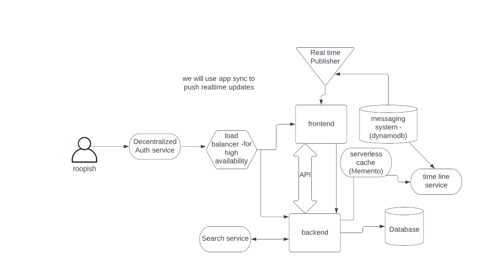

### Recreate Conceptual Diagram of Crudder in Lucid - link
[Lucid chart Conceptual Share Link](https://lucid.app/lucidchart/12d2d0a4-1760-4c73-9f78-3585d99b6e74/edit?viewport_loc=-565%2C-246%2C2048%2C878%2C0_0&invitationId=inv_86a39f63-6239-4c17-9e13-1e95a15d3005)

### Recreate Conceptual Diagram of Crudder on a napkin - screenshot
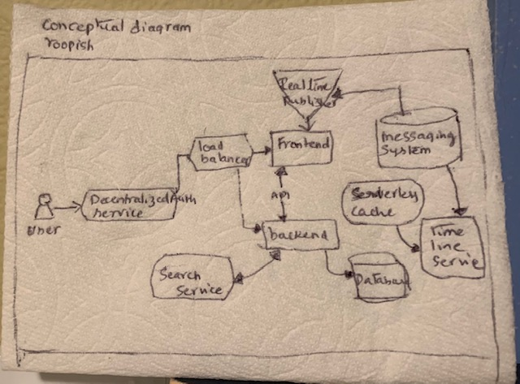

### Recreate Logical Diagram of Crudder on a Lucid Chart - screenshot
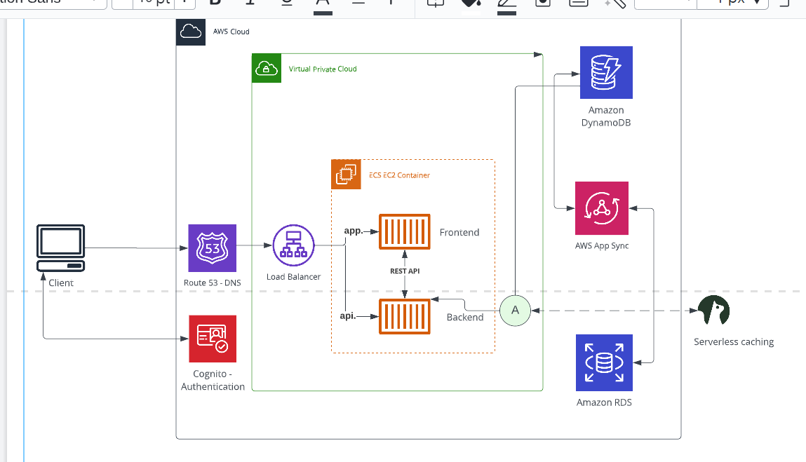

### Recreate Logical Diagram of Crudder on a Lucid Chart - link
[Lucid chart Logical Share Link](https://lucid.app/lucidchart/f84c84c7-a219-401e-845f-33527b7d8547/edit?viewport_loc=-272%2C-486%2C2208%2C878%2C0_0&invitationId=inv_fec598ac-86a2-4820-8dce-a326cb8e8d62)

### Install AWS CLI
1. As i watched the class video, I paused and worked with the commands on gitpod. 

### Create a Billing Alarm
I am attaching the json code screenshot for proof. (PS: I have scratched out my accountid number) 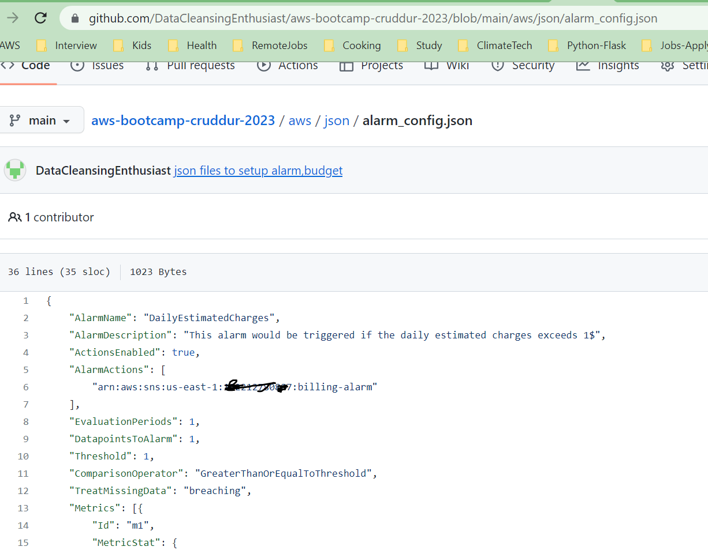
I also took a screenshot of 'Alarm in Cloud watch' 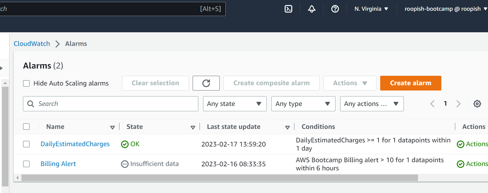

### Create a Budget
1. Using the documentation listed in the References section, I copied budget.json and notifications.json files to gitpod. I saved them under /aws/json.
I changed the $amount for budget to $10 and the renamed it to "Example Tag budget using CLI" attached screenshot 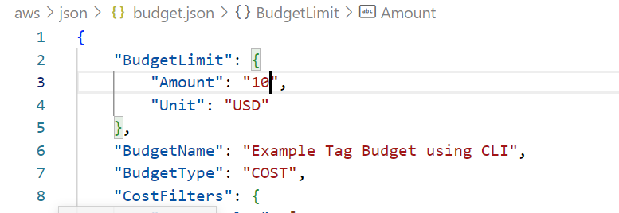
2. Please see the attached screenshot for notifications. I updated my email. 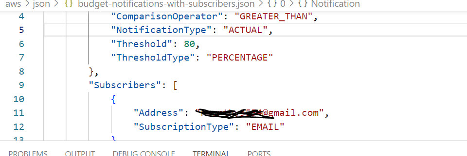
3. I created a persitant environment variable AWS_ACCOUNT_ID to hold my aws account number. I ran the below commands on gitpod to create budget. 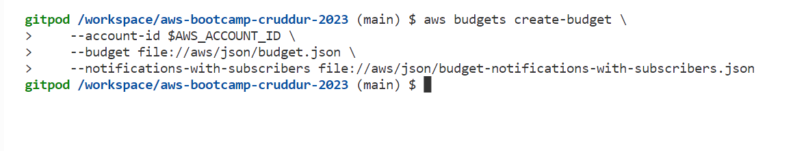
4. To check whether it's created correctly, I logged in as root user to my AWS account and then AWS Billing to Budgets and please see the screenshot the newly created budget 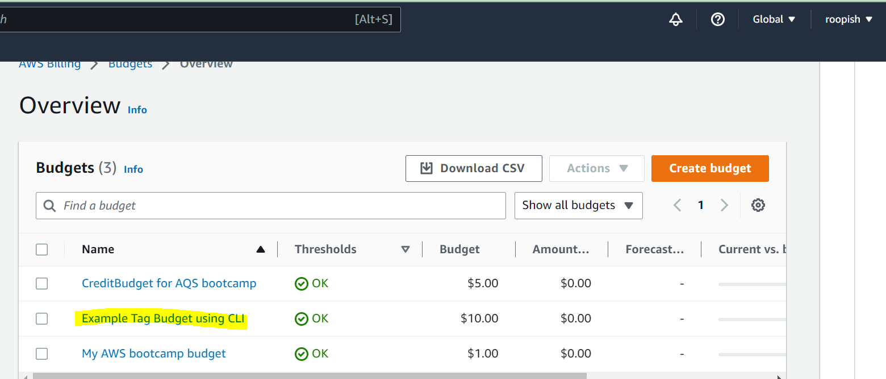

## Homework Challenge

### Set MFA
I encountered few issues while setting up MFA. I first used Authy app and entered consecutive MFA codes but kept getting **Authentication code for device is not valid** error. I installed google authenticator and that fixed the error. 
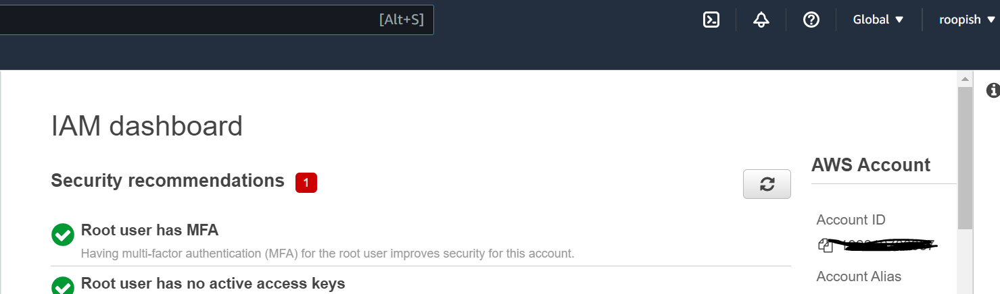

### Create IAM Role
I created Audit Role that allows EC2 instances to call AWS services on my behalf.
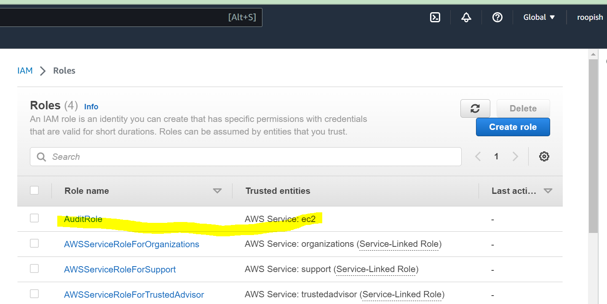

## References
https://docs.aws.amazon.com/cli/latest/reference/budgets/create-budget.html

