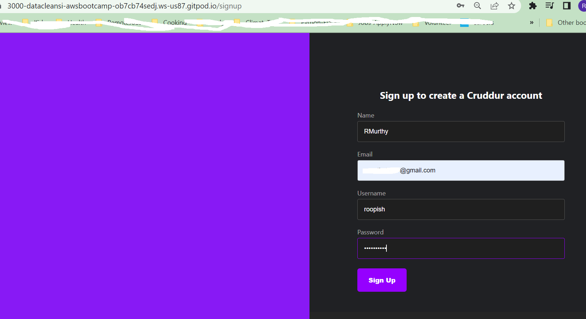
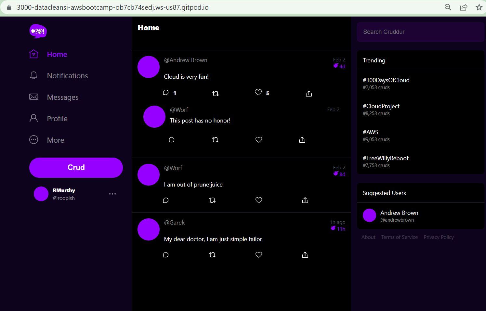
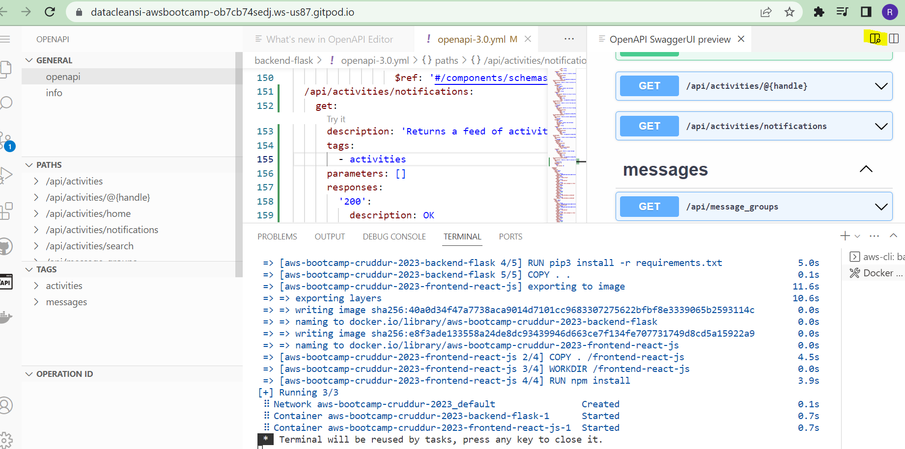
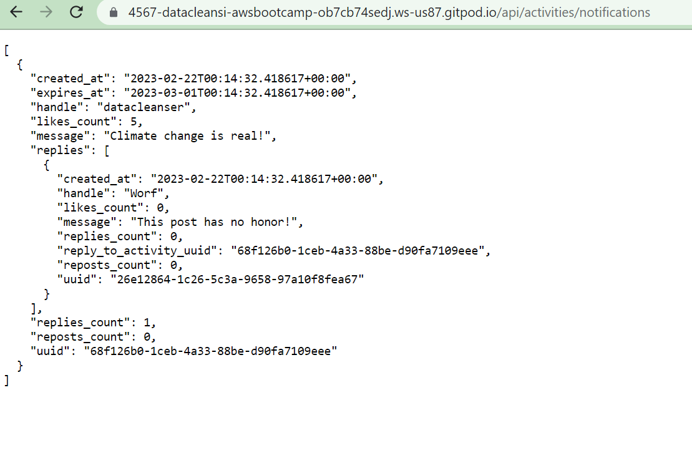
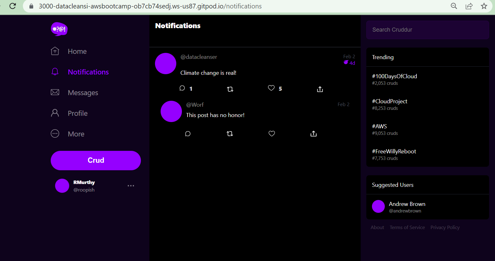
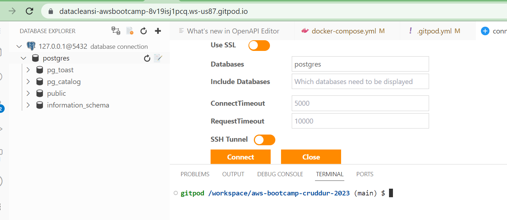
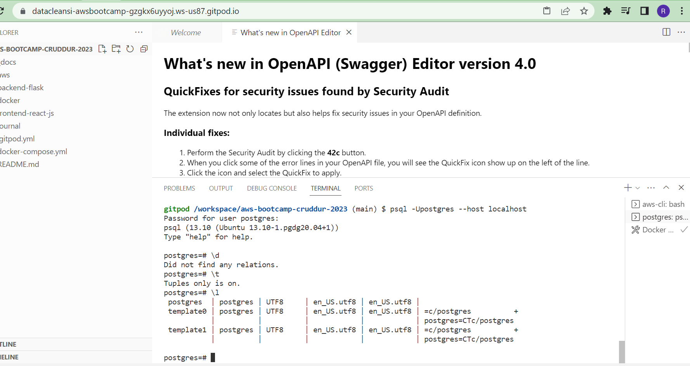
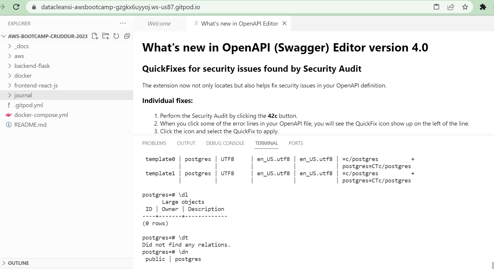
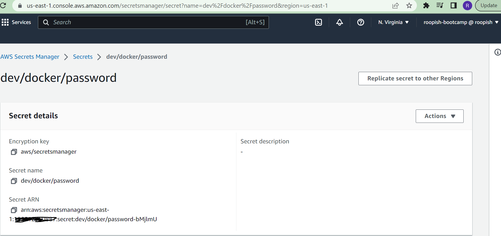

# Week 1 — App Containerization

## Backend
We started off by learning how to containerize using Docker our crudder app. We created a Docker file which installs python libraries used in this app and runs flask at port 4567. Code for this is in

[Backend Dockerfile](https://github.com/DataCleansingEnthusiast/aws-bootcamp-cruddur-2023/blob/main/backend-flask/Dockerfile)

To build and run multi-container Docker applications, we made modifications to docker-compose.yml. To start off with the frontend of the app, we used our login username, email from our bootcamp and created a crudder account after running the docker compose Up command.
Below are screenshots taken in the process

To add an endpoint to our application, we made modifications to backend-flask/openapi-3.0.yml by adding notifications section as seen below

After making modifications to backend-flask/app.py, to add route for /api/activities/notifications below is the screenshot from port 4567 on the browser

## Frontend
frontend/index.js-> This where react starts up.
Go to frontend-react-js/App.js – this is where handle the route for notifications page. After the frontend has been hooked up correctly, we should see the changes in the crudder app's notifications page in the browser at port 3000. 

### Adding DynamoDB Local and Postgres
We integrate them in as containers by adding to docker-compose.yml and reference them externally. We also installed postgres client into Gitpod by executing lines 13,14,15 from [Postgres client](https://github.com/DataCleansingEnthusiast/aws-bootcamp-cruddur-2023/blob/main/.gitpod.yml)
Below is screenshot from gitpod

Here are some postgres commands I tried

## Spend considerations
I also learnt from Chirag’s videos about free tier pricing for gitpod, GitHub codespaces, and AWS Cloud9. I also learnt about enabling to log Management events and not to enable the data events for CloudTrail in your AWS account to avoid charges.

## Security considerations
We also learnt about 10 Docker Security Best Practices for using Docker in Production with docker image security scanning for docker files , compose with speed and security . We learnt about Docker image vulnerability and also looked at Amazon inspector/Clair can be used to scan these vulnerabilities. We also looked at AWS secrets manager as seen below to encrypt credentials.

We also learnt about Synx that checks docker compose vulnerability.
