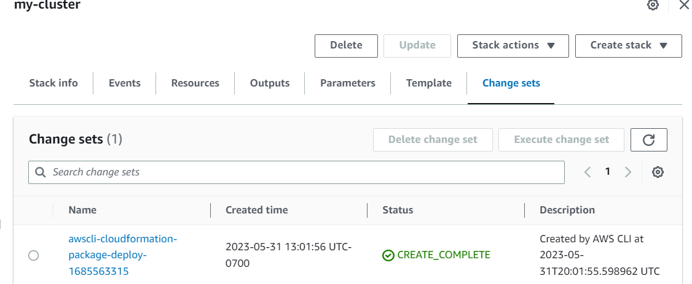
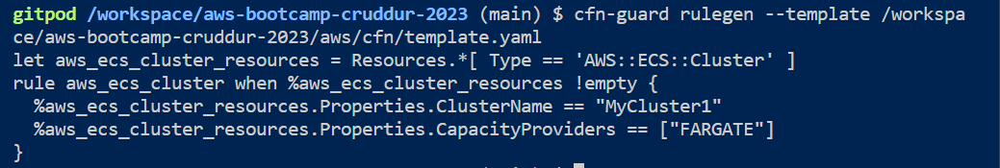
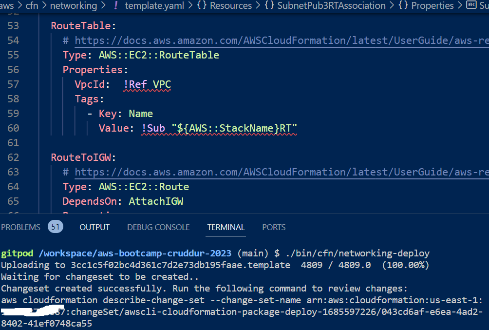
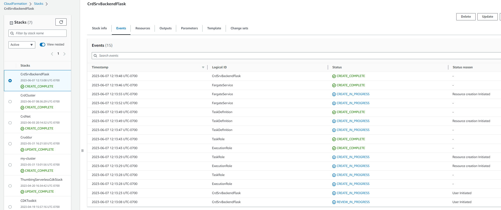
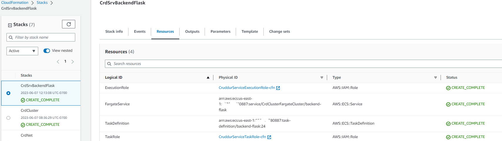

# Week 10 & 11 — CloudFormation - Infrastructure as Code(IaC) tool
Week 10 and 11 is focused on learning about CloudFormation (CFN). CFN allows developers to operate infrastructure with code. Using CloudFormation, users can create AWS resources that aid the execution of AWS-based applications. CFN creates the infrastructure in the right order with the exact configuration you specified in your template. We have used YAML script to write the AWS CloudFormation templates.

## Creation of **a ECS Cluster using** CFN template

In the aws folder we created a cfn folder and created a template.yaml file. After we run this and it sets up a ECS empty Cluster.

```yaml
AWSTemplateFormatVersion: 2010-09-09
Description: |
  Setup ECS Cluster
Resources:
  ECSCluster: #LogicalName
    Type: 'AWS::ECS::Cluster'
    Properties:
      ClusterName: MyCluster1
      CapacityProviders:
        - FARGATE
#Parameters:
#Mappings:
#Outputs:
#Metadata:
```


```
#! /usr/bin/env bash
set -e # stop the execution of the script if it fails

CFN_PATH="/workspace/aws-bootcamp-cruddur-2023/aws/cfn/template.yaml"

aws cloudformation deploy \
  --stack-name "my-cluster" \
  --template-file "$CFN_PATH" \
  --no-execute-changeset \
  --capabilities CAPABILITY_NAMED_IAM
```

I ran chmod u+x ./bin/cfn/deploy and then ran ./bin/cfn/deploy as seen in 


This gives a changeset which needs to be run.


 

In the cluster pick the ‘Change sets’ tab. 

Select the aws cli cloudformation package deploy that was just created and then Click on ‘change set’. This should bring up pop up window where you pick ‘Roll back all stack resources in the AWS console and then click on button ‘Execute change set’. 


 


We learnt about AWS Cloudformation lint. AWS CloudFormation Linter (cfn-lint) is **an open-source tool that you can use to perform detailed validation on your AWS CloudFormation templates**. Cfn-lint contains rules that are guided by the AWS CloudFormation resource specification.  

We installed cfn-lint by running the command `pip install cfn-lint`

 

Now we move onto learning about policy-as-code for cfn-guard for ecs cluster.

We first install `cargo install cfn-guard`

 

We can add installing of cfn-guard and cfn-lint to gitpod.yaml

We create aws/cfn/task-definition.guard

To generate your rules or guard file you need to run this command with specifying the template path.

cfn-guard rulegen --template /workspace/aws-bootcamp-cruddur-2023/aws/cfn/template.yaml

 

Then we created s3 bucket `rm-cfn-artifacts` and deployed that template into s3 bucket.

 

## **Networking Layer**

Rename bin/cfn/deploy to bin/cfn/networking-deploy

We created aws/cfn/Readme.md to document everything as we go along. 

 

 

We created a networking layer where we require VPC, IGW, Routing tables, Subnet’s (3) for flexibility to have in 3 different Availablity Zones. In VPC section, we have CIDR property- where we have given a CIDR IP address as `10.0.0.0/16`. So in here, `/16` is the size of the IP addresses available in that particular CIDR block. You can search it on [CIDR.xyz](https://cidr.xyz/) site to know **how many IPs are available in one particular IP size?** There are redundant links which will help us if one link fails then other will work in that case and it will prevent our apps downtime.

Once we deploy after creating VPC, it will automatically creates a Route Table with no resources and subnets in you VPC Service.

Created aws/cfn/ecs-cluster.guard 
### Create VPC

Create a VPC using CloudFormation.

We created a new folder under aws/cfn/networking. This is where we plan to deploy of networking sources into.

We create template.yaml in this networking folder.

```
Resources:
  VPC:
    # https://docs.aws.amazon.com/AWSCloudFormation/latest/UserGuide/aws-resource-ec2-vpc.html
    Type: AWS::EC2::VPC
    Properties:
      CidrBlock: !Ref VpcCidrBlock
      EnableDnsHostnames: true
      EnableDnsSupport: true
      InstanceTenancy: default
      Tags:
        - Key: Name
          Value: !Sub "${AWS::StackName}VPC"
```

### Create and Attach IGW (Internet gateway)

```yaml
Resources:
IGW:
    # https://docs.aws.amazon.com/AWSCloudFormation/latest/UserGuide/aws-resource-ec2-internetgateway.html
    Type: AWS::EC2::InternetGateway
    Properties:
      Tags:
        - Key: Name
          Value: !Sub "${AWS::StackName}IGW"
  AttachIGW:
    Type: AWS::EC2::VPCGatewayAttachment
    Properties:
      VpcId: !Ref VPC
      InternetGatewayId: !Ref IGW
```

### Create Route Table

```yaml
RouteTable:
    # https://docs.aws.amazon.com/AWSCloudFormation/latest/UserGuide/aws-resource-ec2-routetable.html
    Type: AWS::EC2::RouteTable
    Properties:
      VpcId:  !Ref VPC
      Tags:
        - Key: Name
          Value: !Sub "${AWS::StackName}RT"
```

### Create another Route Table that is related to IGW

```yaml
RouteToIGW:
    # https://docs.aws.amazon.com/AWSCloudFormation/latest/UserGuide/aws-resource-ec2-route.html
    Type: AWS::EC2::Route
    DependsOn: AttachIGW
    Properties:
      RouteTableId: !Ref RouteTable
      GatewayId: !Ref IGW
      DestinationCidrBlock: 0.0.0.0/0
```

### **Create Subnets**

We create Public & Private Subnets and have given reference to those subnets and associated with Route tables.

### Public Subnet

```yaml
SubnetPub1:
   # https://docs.aws.amazon.com/AWSCloudFormation/latest/UserGuide/aws-resource-ec2-subnet.html
   Type: AWS::EC2::Subnet
   Properties:
     AvailabilityZone: !Ref Az1
     CidrBlock: !Select [0, !Ref SubnetCidrBlocks]
     EnableDns64: false
     MapPublicIpOnLaunch: true #public subnet
     VpcId: !Ref VPC
     Tags:
       - Key: Name
         Value: !Sub "${AWS::StackName}PubSubnet1"

```

### Private Subnet

```yaml
SubnetPriv1:
   # https://docs.aws.amazon.com/AWSCloudFormation/latest/UserGuide/aws-resource-ec2-subnet.html
   Type: AWS::EC2::Subnet
   Properties:
     AvailabilityZone: !Ref Az1
     CidrBlock: !Select [3, !Ref SubnetCidrBlocks]
     EnableDns64: false
     MapPublicIpOnLaunch: false #private subnet
     VpcId: !Ref VPC
     Tags:
       - Key: Name
         Value: !Sub "${AWS::StackName}PrivSubnet1"
```

**Associate Subnet 1 with Route table**

```yaml
SubnetPub1RTAssociation:
   Type: AWS::EC2::SubnetRouteTableAssociation
   Properties:
     SubnetId: !Ref SubnetPub1
     RouteTableId: !Ref RouteTable
```

**NOTE:** We created 3 subnets by following the similar code pattern with different IPs.

Refer the documentation [AWS Documentation of CFN Parameters](https://docs.aws.amazon.com/AWSCloudFormation/latest/UserGuide/parameters-section-structure.html) for syntax information. CFN will now allow you to hardcode the values in it's `template.yaml` file. We have to make sure to set parameters. 



 

Execute the change set.

After creating the subnets, VPCs, Route Tables we deployed Networking Layer and it uploaded in our CloudFormation Stack. **Resources after deploying Networking Layer** 


Here’s the [template.yaml](https://github.com/DataCleansingEnthusiast/aws-bootcamp-cruddur-2023/blob/main/aws/cfn/networking/template.yaml)


We started creating the Architecture diagram for CFN.
## **Cluster Layer**

This layer will help support the fargate containers. We added ALB that supports IPv4. This layer also has ALB security groups, HTTP listener, Backend and Frontend target groups. To get CertificateArn,go to **[AWS Certificate Manager (ACM)](https://us-east-1.console.aws.amazon.com/acm/home?region=us-east-1#/welcome) a**nd then get the ARN. Refer to [template.yaml](https://github.com/DataCleansingEnthusiast/aws-bootcamp-cruddur-2023/blob/main/aws/cfn/cluster/template.yaml)

We create [cluster file](https://github.com/DataCleansingEnthusiast/aws-bootcamp-cruddur-2023/blob/main/bin/cfn/cluster) to deploy CFN cluster stack. 

**Note**: I did not delete the ALB /TG which were created earlier along with the ECS cluster's task frontend-react-js and backend which were created in week 6.

### Install toml

 Install toml `gem install cfn-toml`

 

Run /bin/cfn/cluster-deploy 

 

 

 

 

 

 

We make updates to Architecture diagram.

## Service Layer

We start to build service layer for backend. Created aws/cfn/service/template.yaml, config.toml and config.toml.example and bin/service/service.deploy

config.toml file which has key configuration details such as the name of the stack -CrdSrvBackendFlask , region of deployment, S3 Bucketname, Envr Variables for Frontend and Backend URls, DDB MessageTble are referenced by the CFN template. 

.bin/cfn/service script is run which deploys the service stack.

CFN ECS Fargate Service Debugging - In Ec2 target groups→ CrdClu-Backe -xx change the timeout from 5 to 15 healthy threshold to 3, interval=20 

  and  






Go to Ec2 Security Groups and pick ****crud-srv-sg and change inbound rule****    


Go to bin/backend/deploy  Change the CLUSTER_NAME="CrdClusterFargateCluster” (old name”cruddur”)

update bin/backend/deploy and bin/backend/create-service and execute them
