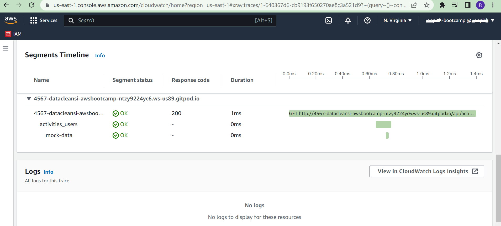
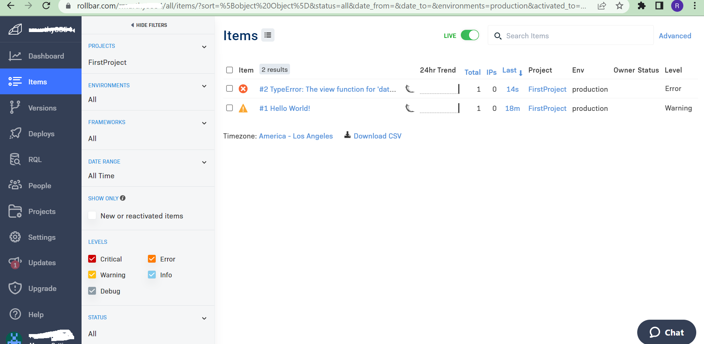
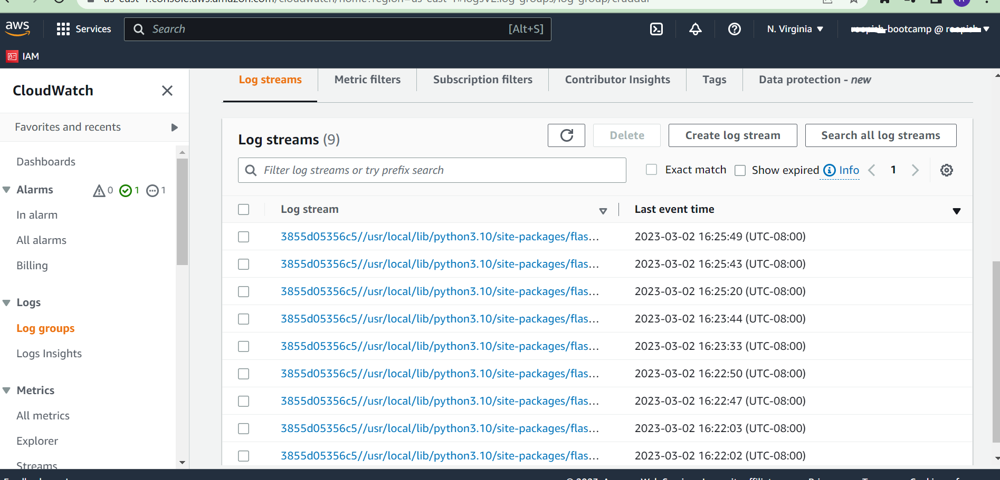
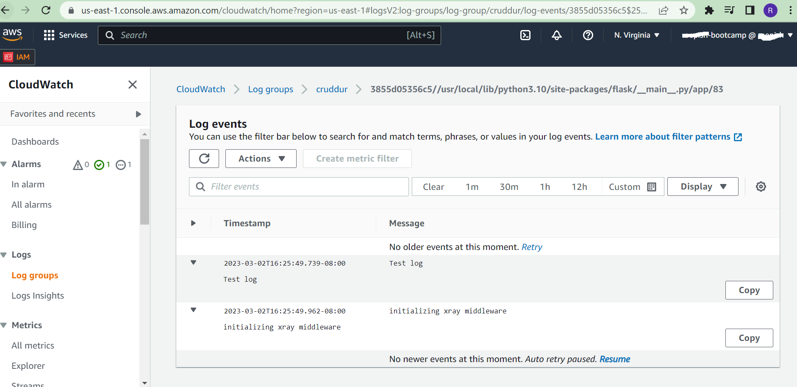

# Week 2 — Distributed Tracing

## Honeycomb
I updated backend flask application to use Open Telemetry (OTEL) with Honeycomb.io as the provider. I updated requirements.txt and using pip install, we installed opentelemetry for python. 
We set env variable HONEYCOMB_API_KEY that we got from Honeycomb.io and HONEYCOMB_SERVICE_NAME='crudder'. Note: Honeycomb creates a test environment and the API_KEY from this environment should not be used. Initially I used this and was unable to see logs and later realized my mistake.
We ran queries to explore traces within Honeycomb and learnt about SimpleSpanProcessor which processes spans as they are created.
Attached are the 2 screenshots from Honeycomb

## X-Ray
We instrumented AWS X-Ray into backend flask application and looked at X-Ray traces in aws console. I made changes to requirements.txt to add 
aws-xray-sdk. We also added a xray.json file to learn to manually set up Sampling rules.

  

We created a Xray segment , subsegment and were running into errors. We were not able to see the mock-data. In useractivities.py, we enclosed the code in try and finally and removed the segment code. We had to call xray_recorder.end_segment() before creating a new segment, otherwise the new segment overwrites the existing one. 

## Rollbar

We learnt about another tool Rollbar and help us for error logging and tracing.

We added endpoint just for testing rollbar to app.py

After creating a new project ‘Crudder’ in Rollbar, we intentionally created and error in our code and removed a ‘return’ statement.

This is the error in the browser for the missing return

This is the error logging and trace from out backend flask to Rollbar

## Watchtower
Using CloudWatch, we looked at LOGGER.info and pushed a ‘Test log’ message from backend – app.py. To test if our Crudder app is properly plugged to CloudWatch to trace logs, we refresh the browser several times. 

When we click on the details of the recent log, we see that the message ‘Test log’ has been pushed from our app to Cloud Watch. 

## Career advice video
I also watched the first Cloud career video. As of this week, I made some points for myself to focus.
#### My Journey to the Cloud
##### I am going to be :
    Backend Engineer 
##### I am a good fit: 
    I have 10+ years experience in backend engg but hoping to acquire skills to get to the next level
##### I will not get distracted by:
    front engg tools
    focus first on AWS and not other cloud providers
Note: this part will be updated in the upcoming weeks

