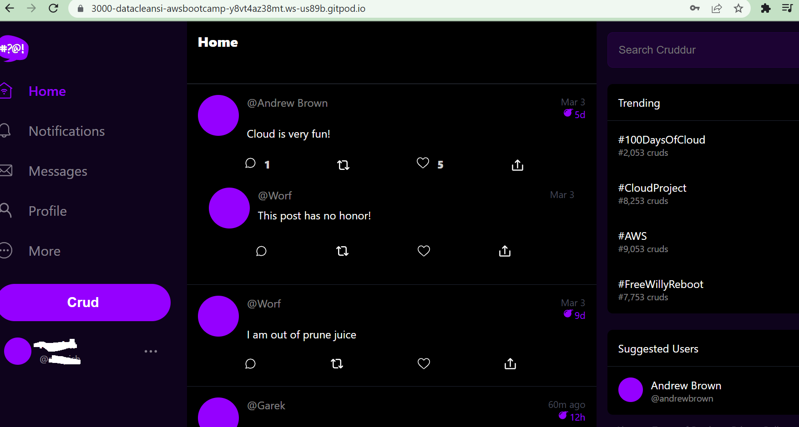

# Week 3 — Decentralized Authentication
# ****Setup Cognito User Pool****

1. With valid aws credentials, logged into AWS console and using the search box, found and opened Cognito.
2. In Cognito, made sure I was in the right region (us-east-1)
3. I then clicked on *Create user pool. Following are the different options that I picked*

     a.  Cognito user pool sign-in options: Email

     b. Password policy: Cognito default

     b.  Multi-factor authentication: No MFA

     c.  User account recovery: Enable self-service account recovery(checked) and Delivery method for user account recovery messages is “Email only”

    d.  Configure sign-up experience - Leave all the default settings as is, except for “Required attributes” , where we add name, preferred_username

   e. In the Configure message delivery, pick the “Send email with Cognito” option

   f. In the “Integrate your app” section, I picked user pool name: ‘crudder-user-pool’ and app client name: ‘crudder’**

4. Reviewed and completed the creation by clicking the *Create user pool*


## Setup Environment Variables for Frontend and to Enable Sign in

1. To interact with aws-cognito from the frontend, we need to install aws-amplify. From the command line, I navigated to the frontend folder. Then I ran the following command:

`$ npm i aws-amplify --save`

Note: -- save option is used because we want this saved in package.json as a developer tool. After running the above command check package.json to see it included.

b. To configure the aws-amplify, the following was added in the [App.js](https://github.com/DataCleansingEnthusiast/aws-bootcamp-cruddur-2023/blob/main/frontend-react-js/src/App.js) file: 

```jsx
import { Amplify} from 'aws-amplify';
Amplify.configure({
  "AWS_PROJECT_REGION": process.env.REACT_APP_AWS_PROJECT_REGION,
  "aws_cognito_identity_pool_id": process.env.REACT_APP_AWS_COGNITO_IDENTITY_POOL_ID,
  "aws_cognito_region": process.env.REACT_APP_AWS_COGNITO_REGION,
  "aws_user_pools_id": process.env.REACT_APP_AWS_USER_POOLS_ID,
  "aws_user_pools_web_client_id": process.env.REACT_APP_CLIENT_ID,
  "oauth": {},
  Auth: {
    // We are not using an Identity Pool
    // identityPoolId: process.env.REACT_APP_IDENTITY_POOL_ID, // REQUIRED - Amazon Cognito Identity Pool ID
    region: process.env.REACT_APP_AWS_PROJECT_REGION,           // REQUIRED - Amazon Cognito Region
    userPoolId: process.env.REACT_APP_AWS_USER_POOLS_ID,         // OPTIONAL - Amazon Cognito User Pool ID
    userPoolWebClientId: process.env.REACT_APP_CLIENT_ID,   // OPTIONAL - Amazon Cognito Web Client ID (26-char alphanumeric string)
  }
});
```

c. Following modifications were made to the [HomeFeedPage](https://github.com/DataCleansingEnthusiast/aws-bootcamp-cruddur-2023/blob/main/frontend-react-js/src/pages/HomeFeedPage.js).js

```jsx
import { Auth } from 'aws-amplify';
// Check Auth Method was changed to 
const checkAuth = async () => {
    Auth.currentAuthenticatedUser({ 
      //checks to see if user is authenticated, if yes logs the user and 
      // returns authenticated user and passes this info to cognito_user.
      // Optional, By default is false. 
      // If set to true, this call will send a 
      // request to Cognito to get the latest user data
      bypassCache: false 
    })
    .then((user) => {
      console.log('user',user);
      return Auth.currentAuthenticatedUser()
    }).then((cognito_user) => {
        setUser({
          display_name: cognito_user.attributes.name,
          handle: cognito_user.attributes.preferred_username
        })
    })
    .catch((err) => console.log(err));
  };
```

d. To enable signing in with a cognito username, the following modifications were made to the [SigninPage.js](https://github.com/DataCleansingEnthusiast/aws-bootcamp-cruddur-2023/blob/main/frontend-react-js/src/pages/SigninPage.js) file:
 

```jsx
import { Auth } from 'aws-amplify';
// changed onsubmit method
const onsubmit = async (event) => {
    setErrors('')
    event.preventDefault();
    console.log('onsubmit')
    Auth.signIn(email, password)
    .then(user => {
      console.log('user',user)
      localStorage.setItem("access_token", user.signInUserSession.accessToken.jwtToken)
      window.location.href = "/"
    })
    .catch(error => { 
      if (error.code == 'UserNotConfirmedException') {
        window.location.href = "/confirm"
      }
      setErrors(error.message)
    });
    return false
  }
```

e. Finally, to allow user sign-out, the [ProfileInfo.js](https://github.com/DataCleansingEnthusiast/aws-bootcamp-cruddur-2023/blob/main/frontend-react-js/src/components/ProfileInfo.js) file was modified as follows:

```jsx
import { Auth } from 'aws-amplify';
// sign-out method modified
const signOut = async () => {
 try {
     await Auth.signOut({ global: true });
     window.location.href = "/"
 } catch (error) {
     console.log('error signing out: ', error);
    }
}
```

f. To all environment keys propagate properly, commit and push code to GitHub and close gitpod and reopen again.

g. Use the aws-cli to set a password with admin rights to avoid verification. Used the command below

```jsx
aws cognito-idp admin-set-user-password \
 --user-pool-id <your-user-pool-id> \
 --username <username> \
 --password <password> \
 --permanent
```

Attached is the verification email with code: 

Logged in as myself 

Confirmed email and user


## `Implementing Custom Signup, Confirmation, and Recovery Page`

1. Modified the [SignupPage.js](https://github.com/DataCleansingEnthusiast/aws-bootcamp-cruddur-2023/blob/main/frontend-react-js/src/pages/SignupPage.js) file: 

```jsx
import { Auth } from 'aws-amplify';
//modified on-submit
const onsubmit = async (event) => {
    event.preventDefault();
    setErrors('')
    try {
    const { user } = await Auth.signUp({
      username: email,
      password: password,
      attributes: {
        name: name,
        email: email,
        preferred_username: username,
      },
      autoSignIn: { // optional - enables auto sign in after user is confirmed
        enabled: true,
      }
    });
    console.log(user);
    window.location.href = `/confirm?email=${email}`
  } catch (error) {
      console.log(error);
      setErrors(error.message)
  }
    return false
  }
```

b. Modified [ConfirmationPage.js](https://github.com/DataCleansingEnthusiast/aws-bootcamp-cruddur-2023/blob/main/frontend-react-js/src/pages/ConfirmationPage.js)

```jsx
import { Auth } from 'aws-amplify';
// modified these 2 methods
const resend_code = async (event) => {
    setErrors('')
    try {
      await Auth.resendSignUp(email);
      console.log('code resent successfully');
      setCodeSent(true)
    } catch (err) {
      // does not return a code
      // does cognito always return english
      // for this to be an okay match?
      console.log(err)
      if (err.message == 'Username cannot be empty'){
        setErrors("You need to provide an email in order to send Resend Activiation Code")   
      } else if (err.message == "Username/client id combination not found."){
        setErrors("Email is invalid or cannot be found.")   
      }
    }
  }

  const onsubmit = async (event) => {
    event.preventDefault();
    setErrors('')
    try {
      await Auth.confirmSignUp(email, code);
      window.location.href = "/"
    } catch (error) {
      setErrors(error.message)
    }
    return false
  }
```

c. Modified [RecoveryPage.js](https://github.com/DataCleansingEnthusiast/aws-bootcamp-cruddur-2023/blob/main/frontend-react-js/src/pages/RecoverPage.js)

```jsx
import { Auth } from 'aws-amplify';
//updated onsubmit_send_code and onsubmit_confirm_code methods
const onsubmit_send_code = async (event) => {
    event.preventDefault();
    setErrors('')
    Auth.forgotPassword(username)
    .then((data) => setFormState('confirm_code') )
    .catch((err) => setErrors(err.message) );
    return false
  }

  const onsubmit_confirm_code = async (event) => {
    event.preventDefault();
    setErrors('')
    if (password == passwordAgain){
      Auth.forgotPasswordSubmit(username, code, password)
      .then((data) => setFormState('success'))
      .catch((err) => setErrors(err.message) );
    } else {
      setErrors('Passwords do not match')
    }
    return false
  }
```

d. Test for recovering password is shown below:


## Update frontend css for better color contrast on my windows machine

I also made changes to [Index.css](https://github.com/DataCleansingEnthusiast/aws-bootcamp-cruddur-2023/blob/main/frontend-react-js/src/index.css) to carry the properties below to other css files in our project

```jsx
:root {
  --bg: rgb(61,13,123);
  --fg: rgb(8,1,14);

  --field-border: rgb(255,255,255,0.29);
  --field-border-focus: rgb(rgb(214, 205, 222));
  --field-bg: rgb(31,31,31);
}
//modified
* { box-sizing: border-box; }
html,body { 
  height: 100%; 
  width: 100%; 
  background: var(--bg);
}
```

I also made modifications to JoinSection.css, [App.css](https://github.com/DataCleansingEnthusiast/aws-bootcamp-cruddur-2023/blob/main/frontend-react-js/src/App.css), [Search.css](https://github.com/DataCleansingEnthusiast/aws-bootcamp-cruddur-2023/blob/main/frontend-react-js/src/components/Search.css), [SigninPage.css](https://github.com/DataCleansingEnthusiast/aws-bootcamp-cruddur-2023/blob/main/frontend-react-js/src/pages/SigninPage.css), [SignupPage.css](https://github.com/DataCleansingEnthusiast/aws-bootcamp-cruddur-2023/blob/main/frontend-react-js/src/pages/SignupPage.css) to use the colors set in bg, fg, field-border, field-border-focus, field-bg, background

Modified [ActivityItem.css](https://github.com/DataCleansingEnthusiast/aws-bootcamp-cruddur-2023/blob/main/frontend-react-js/src/components/ActivityItem.css) 

```jsx
border-bottom: solid 1px rgb(60,54,79); 
```

Modified [DesktopSidebar.css](https://github.com/DataCleansingEnthusiast/aws-bootcamp-cruddur-2023/blob/main/frontend-react-js/src/components/DesktopSidebar.css) 

```jsx
color: rgba(255,255,255,0.5);
```

1. This week we learnt to implement a decentralized authentication service into a web-application with custom login and signup pages in our react application. 
2. We learnt to create AWS cognito user pool using aws console. 
3. We also learnt to implement API calls to Amazon Cognito for login, signup, recovery and forgot password page
4. We also modified .css pages to change background color so that color contrast on Windows machines look better for out Crudder app.
