# Week 6 — Deploying Containers
## Test RDS Connection

Added this `test` script so we can easily check our connection from our container.
[testconnection](https://github.com/DataCleansingEnthusiast/aws-bootcamp-cruddur-2023/blob/main/bin/db/test)


## Task Flask Script

We will add a health-check endpoint for our flask application in app.py:

```python
@app.route('/api/health-check')
def health_check():
  return {'success': True}, 200
```

We'll create a new bin script at `bin/flask/health-check` and this script gets moved to a different folder /backend-flask/bin folder

[health-check](https://github.com/DataCleansingEnthusiast/aws-bootcamp-cruddur-2023/blob/main/backend-flask/bin/health-check)


## Create CloudWatch Log Group

```sh
aws logs create-log-group --log-group-name cruddur
aws logs put-retention-policy --log-group-name cruddur --retention-in-days 1
```


## Create ECS Cluster

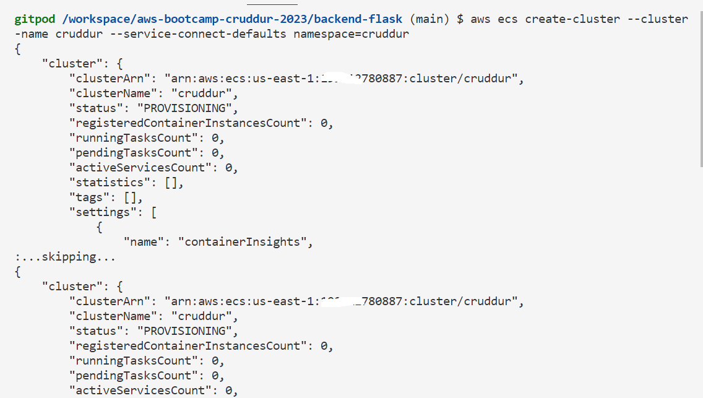


## Gaining Access to ECS Fargate Container

### Create ECR repo and push image

#### For Base-image python


#### Login to ECR

```sh
aws ecr get-login-password --region $AWS_DEFAULT_REGION | docker login --username AWS --password-stdin "$AWS_ACCOUNT_ID.dkr.ecr.$AWS_DEFAULT_REGION.amazonaws.com"
```


#### Set URL

```sh
export ECR_PYTHON_URL="$AWS_ACCOUNT_ID.dkr.ecr.$AWS_DEFAULT_REGION.amazonaws.com/cruddur-python"
echo $ECR_PYTHON_URL
```


#### Pull,Tag,list Image


#### Push Image

```sh
docker push $ECR_PYTHON_URL:3.10-slim-buster
```
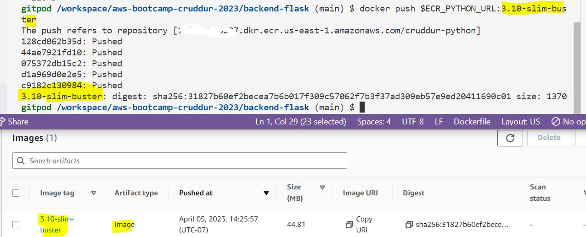


Replace the python image in the Dockerfile of backend-flask and do a docker compose up and then run the health check
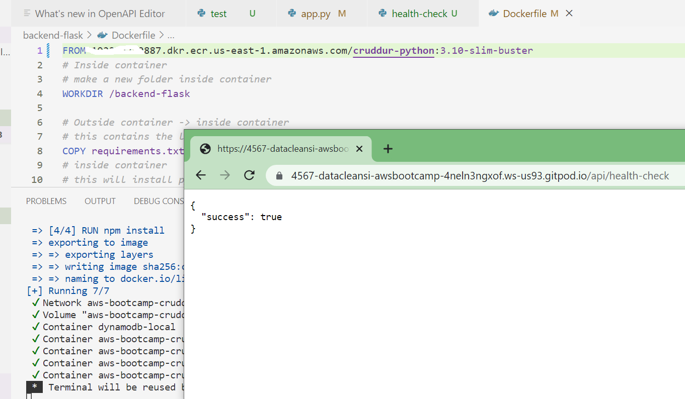

#### Create Repo for backend
```sh
aws ecr create-repository \
  --repository-name backend-flask \
  --image-tag-mutability MUTABLE
```
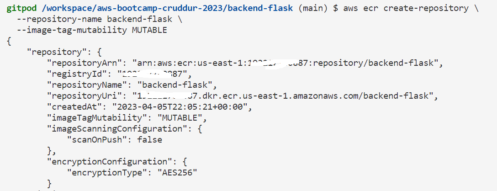


#### Set URL

```sh
export ECR_BACKEND_FLASK_URL="$AWS_ACCOUNT_ID.dkr.ecr.$AWS_DEFAULT_REGION.amazonaws.com/backend-flask"
echo $ECR_BACKEND_FLASK_URL
```


#### Build Image
Make sure you are in the correct directory i.e. backend-flask 

```sh
docker build -t backend-flask .
```
#### Tag Image

```sh
docker tag backend-flask:latest $ECR_BACKEND_FLASK_URL:latest
```

#### Push Image

```sh
docker push $ECR_BACKEND_FLASK_URL:latest
```
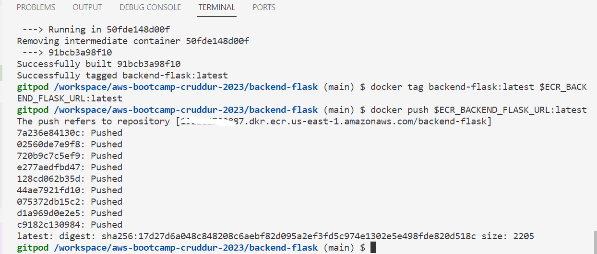


## Register Task Defintions


### Passing Senstive Data to Task Defintion
We will store sensitive data in the AWS Systems Manager->Parameter Store

```sh
aws ssm put-parameter --type "SecureString" --name "/cruddur/backend-flask/AWS_ACCESS_KEY_ID" --value $AWS_ACCESS_KEY_ID
aws ssm put-parameter --type "SecureString" --name "/cruddur/backend-flask/AWS_SECRET_ACCESS_KEY" --value $AWS_SECRET_ACCESS_KEY
aws ssm put-parameter --type "SecureString" --name "/cruddur/backend-flask/CONNECTION_URL" --value $PROD_CONNECTION_URL
aws ssm put-parameter --type "SecureString" --name "/cruddur/backend-flask/ROLLBAR_ACCESS_TOKEN" --value $ROLLBAR_ACCESS_TOKEN
aws ssm put-parameter --type "SecureString" --name "/cruddur/backend-flask/OTEL_EXPORTER_OTLP_HEADERS" --value "x-honeycomb-team=$HONEYCOMB_API_KEY"
```


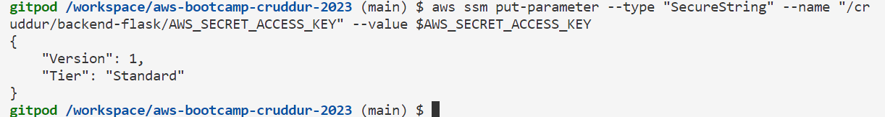


### Create Task and Execution Roles for Task Definition

#### Create ExecutionRole
Create a file under aws/policies/service-execution-policy.json

```aws
aws iam create-role \
    --role-name CruddurServiceExecutionRole \
    --assume-role-policy-document
    file://aws/policies/service-execution-policy.json
```


#### Create ExecutionPolicy
```sh
aws iam create-role \
--role-name CruddurServiceExecutionPolicy  \
--assume-role-policy-document "file://aws/policies/service-assume-role-execution-policy.json"
```


```sh
aws iam put-role-policy \
  --policy-name CruddurServiceExecutionPolicy \
  --role-name CruddurServiceExecutionRole \
  --policy-document file://aws/policies/service-execution-policy.json
"
```


```sh
aws iam attach-role-policy --policy-arn POLICY_ARN --role-name CruddurServiceExecutionRole
```

```sh
aws iam attach-role-policy \
    --policy-arn arn:aws:iam::aws:policy/service-role/AmazonECSTaskExecutionRolePolicy \
    --role-name CruddurServiceExecutionRole
```

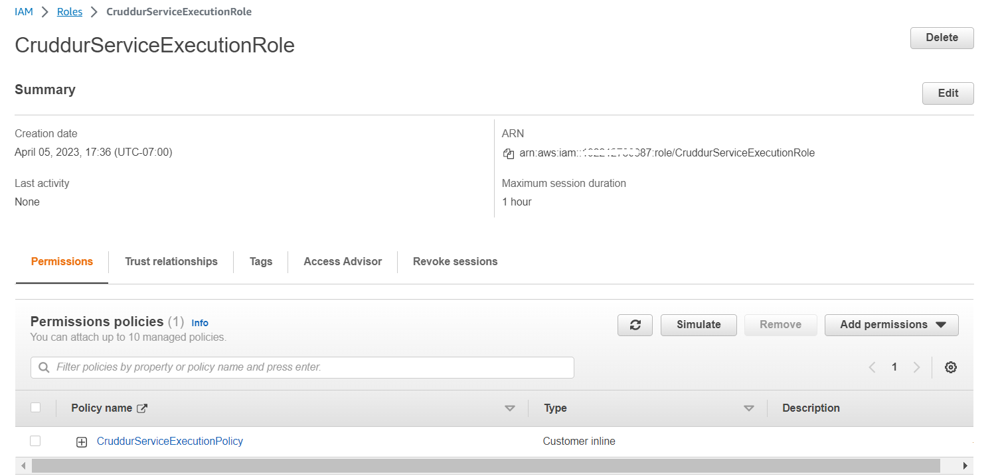


#### Create TaskRole

```aws
aws iam put-role-policy \
  --policy-name SSMAccessPolicy \
  --role-name CruddurTaskRole \
  --policy-document "{
  \"Version\":\"2012-10-17\",
  \"Statement\":[{
    \"Action\":[
      \"ssmmessages:CreateControlChannel\",
      \"ssmmessages:CreateDataChannel\",
      \"ssmmessages:OpenControlChannel\",
      \"ssmmessages:OpenDataChannel\"
    ],
    \"Effect\":\"Allow\",
    \"Resource\":\"*\"
  }]
}"
```
```
aws iam attach-role-policy --policy-arn arn:aws:iam::aws:policy/CloudWatchFullAccess --role-name CruddurTaskRole
aws iam attach-role-policy --policy-arn arn:aws:iam::aws:policy/AWSXRayDaemonWriteAccess --role-name CruddurTaskRole
```


### Create Json file
Create a new folder called [aws/task-definitions](https://github.com/DataCleansingEnthusiast/aws-bootcamp-cruddur-2023/tree/main/aws/task-definitions) and update appropriate values with my account info.


### Register Task Defintion

```sh
aws ecs register-task-definition --cli-input-json file://aws/task-definitions/backend-flask.json
```
```sh
aws ecs register-task-definition --cli-input-json file://aws/task-definitions/frontend-react-js.json
```


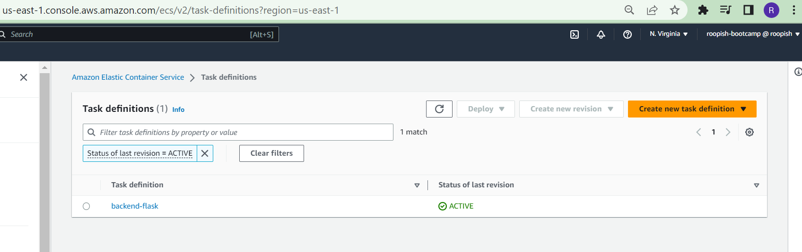


Created a cluster service in the AWS console


## Defaults

Default VPC_ID
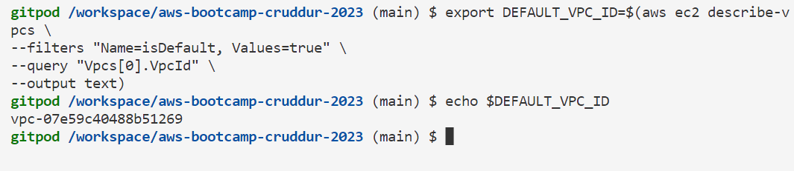

```sh
export DEFAULT_SUBNET_IDS=$(aws ec2 describe-subnets  \
 --filters Name=vpc-id,Values=$DEFAULT_VPC_ID \
 --query 'Subnets[*].SubnetId' \
 --output json | jq -r 'join(",")')
echo $DEFAULT_SUBNET_IDS
```

### Create Security Group


Edit permissions to ECR to execute ECS


----------------------------
### Connection via Sessions Manaager (Fargate)


 Install for Ubuntu

 ```sh
 curl "https://s3.amazonaws.com/session-manager-downloads/plugin/latest/ubuntu_64bit/session-manager-plugin.deb" -o "session-manager-plugin.deb"
 sudo dpkg -i session-manager-plugin.deb
 ```

 To verify whether it is working

 ```sh
 session-manager-plugin
 ```
 


Connect to the container

 ```sh
aws ecs execute-command  \
--region $AWS_DEFAULT_REGION \
--cluster cruddur \
--task xxxxxxxxxxx \
--container backend-flask \
--command "/bin/bash" \
--interactive
```


### Create ECS cluster Service using json aws cli
create a new file under aws/json/service-backend-flask.json

[aws/json/service-backend-flask.json](https://github.com/DataCleansingEnthusiast/aws-bootcamp-cruddur-2023/blob/main/aws/json/service-backend-flask.json)

### Create Services

```sh
aws ecs create-service --cli-input-json file://aws/json/service-backend-flask.json
```

```sh
aws ecs create-service --cli-input-json file://aws/json/service-frontend-react-js.json
```


### Create a bash script to connect-to-service of ECS cluster

[Code for Backend connect](https://github.com/DataCleansingEnthusiast/aws-bootcamp-cruddur-2023/blob/main/bin/backend/connect)


Update the security group for the backend-flask for port 4567 and run health check


**Create a LOAD BALANCER on the AWS console**

 a) Create Application Load Balancer cruddur-alb, Internet-facing, IPv4 address type
 

### create the aws ecs service and add the Load balancer

Run the create service command

```aws
aws ecs create-service --cli-input-json file://aws/json/service-backend-flask.json
```


 


### Build the frontend-react-js

Create production version of dockerfile [backend-flask/Dockerfile.prod](https://github.com/DataCleansingEnthusiast/aws-bootcamp-cruddur-2023/blob/main/backend-flask/Dockerfile.prod)

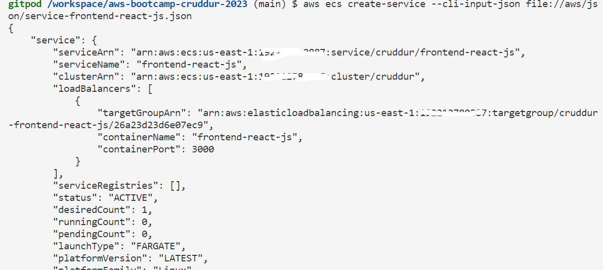

### For Frontend React

We created a folder for building, Tag, Push, register and deploy the image
[bin/frontend](https://github.com/DataCleansingEnthusiast/aws-bootcamp-cruddur-2023/blob/main/bin/frontend)


### Create Services
```aws
aws ecs create-service --cli-input-json file://aws/json/service-frontend-react-js.json
```

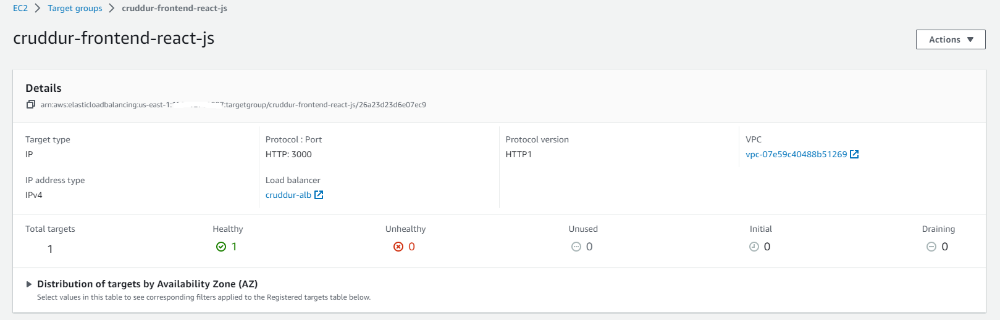

**Made sure your RDS should be up and running i.e.using PROD-CONNECTION_URL**

#### I created a Hosted domain name for my domainname using AWS Route 53


#### Create a certificate manager to request for SSL certificate


click on the create a record in Route53


**EDIT the ALB to manage the rules**


Add a listener for redirecting to 443 to forward to frontend-react-js app with the newly created certificate. Remove the other listeners for port 4567 and 3000. Create a record in the Route53 for a ALB.

**curl the dns and see whether it is working or not**


**Test in the browser**


**Edit the task definition for backend-flask with dns names
```json
"environment": [
 ...
          {"name": "FRONTEND_URL", "value": "https://roopish-awssolutions.com"},
          {"name": "BACKEND_URL", "value": "https://api.roopish-awssolutions.com"},
  ...        
        ],
```
[task-definitions/backend-flask.json](https://github.com/DataCleansingEnthusiast/aws-bootcamp-cruddur-2023/blob/main/aws/task-definitions/backend-flask.json)

### Login to ECR to push the new frontend image
```aws
aws ecr get-login-password --region $AWS_DEFAULT_REGION | docker login --username AWS --password-stdin "$AWS_ACCOUNT_ID.dkr.ecr.$AWS_DEFAULT_REGION.amazonaws.com"
```
### Set URL
```sh
export ECR_FRONTEND_REACT_URL="$AWS_ACCOUNT_ID.dkr.ecr.$AWS_DEFAULT_REGION.amazonaws.com/frontend-react-js"
echo $ECR_FRONTEND_REACT_URL
```

### Built the Image for frontend, tag the image, push and deploy it

Test my website https://roopish-awssolutions.com/


# Securing Flask

change the ports 443 and 80 to access only my ip and then test the api.


### Created script file for the ECR Login
[Login](https://github.com/DataCleansingEnthusiast/aws-bootcamp-cruddur-2023/blob/main/bin/ecr/login)

# Implement Refresh Token Cognito

First Login into the ecr by running ./bin/ecr/login
Do the docker compose up
Setup postgres by running ./bin/db/setup file
Run dynamodb schema-load ./bin/ddb/schema-load
Run the dynamodb seed file ./bin/ddb/seed
Test the app is working fine


modify the code in the CheckAuth.js in frontend-react-js
Modify the code in other files where the CheckAuth.js library is imported.
Messagefeed.js,Homefeedpage.js,messagegroupsPage.js, messagegrouppage.js, messagegroupsNewPage.js

Then test the frontend App is able to refresh the token properly.

# Fix Messaging In Production
Restructure the script file in the bin directory for the frontend and backend
Connect to the postgres production(rds) using ./bin/db/connect prod

### Created the Kill-all-connection.sql to kill all connections 
[Kill Connections](https://github.com/DataCleansingEnthusiast/aws-bootcamp-cruddur-2023/blob/main/backend-flask/db/kill-all-connections.sql)

We restructured files from backend-flask to bin directory.

Run the Postgres ./bin/db/setup
Run the dynamodb script ./bin/ddb/schema-load
Run the dynamodb seed script file ./bin/db/seed
Docker build the backend-flask with Dockerfile.prod
Push the backend image to ECR using the script ./bin/backend/push
Deploy the backend service with force-deployment using the script ./bin/backend/deploy
Connect to your postgresdb(rds) prod using the script ./bin/db/connect prod

Test the frontend app using the url [https://roopish-awssolutions.com/messages/new/bayko](https://roopish-awssolutions.com/messages/new/bayko)


**Test #1**
1) Docker compose up with AWS_ENDPOINT_URL: "http://dynamodb-local:8000/"
2) Run./bin/db/setup 
3) Run ./bin/ddb/schema-load 
4) Run ./bin/ddb/seed
5) The frontend app Working fine with no issues in the posting the messages

**Test #2:**
1) I commented out AWS_ENDPOINT_URL: "http://dynamodb-local:8000/"
2) docker compose down and Compose up to pick the changes 
3) I was able to post the messages without any issues with dynamodb prod and with local rds.

**Test #3:**
1) Run ./bin/backend/build and ./bin/frontend/build
2) Run ./bin/backend/push and ./bin/frontend/push 
3) Run ./bin/backend/register and ./bin/frontend/register
4) Run ./bin/backend/deploy and ./bin/frontend/deploy

After running Test #3, I get the error __"'NoneType' object is not subscriptable"__ in the Rollbar and a __500 error__ in the when I inspect.


 
 


__Resolution:__
 I talked to Andrew, during office hours and found that cognito_userid is different from the current_user_id. I updated the record with the correct cognito_user_id and it worked.

 


 ### Fargate - Configuring for Container Insights

 Update the Task-definition for the backend and frontend flask to include the x-ray instrumentation in task-definition.

 `aws/task-definitions/backend-flask.json'  and 'aws/task-definitions/frontend-react-js.json'

 ```json
 "containerDefinitions": [
 {
       {
        "name": "xray",
        "image": "amazon/aws-xray-daemon" ,
        "essential": true,
        "portMappings": [
          {
            "name": "xray",
            "containerPort": 2000,
            "protocol": "udp"
          }
        ]
      },
  ```

 - Run ./bin/backend/register
 - Run ./bin/backend/deploy
 - Run ./bin/frontend/register
 - Run ./bin/frontend/deploy

 

 


`Enable container insights'

 - Open the CloudWatch console in your AWS account.
 - select the container cluster(cruddur) which you want to enable the container insights
 - click on the  `update cluster' button to enable the container insights.
 - Select the monitor and 'Enable container insights'.
 - click on the update to apply the changes.
 


### Check the container insights in cloudwatch


### Generate environment variables into a file in the docker compose file to improve  docker networking
using a ruby script to generate-env file and use this file in the docker compose file.

[generate-env](https://github.com/DataCleansingEnthusiast/aws-bootcamp-cruddur-2023/blob/main/bin/backend/generate-env)
This generates backend-flask.env and frontend-react-js.env for backend and frontend respectively.Note: These .env files should be added to .gitignore file

Run the docker compose up and see the app is working as expected.
