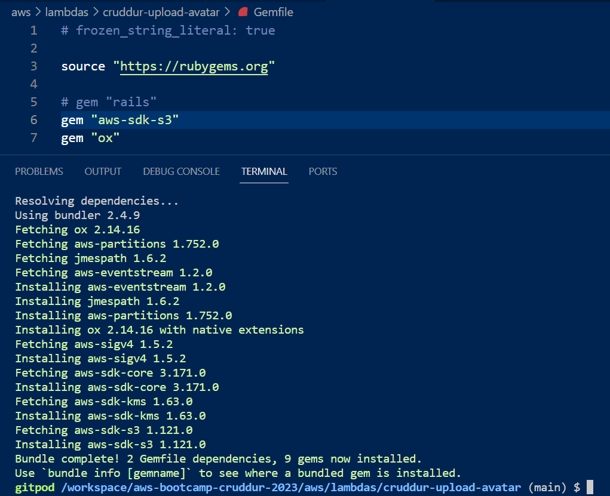
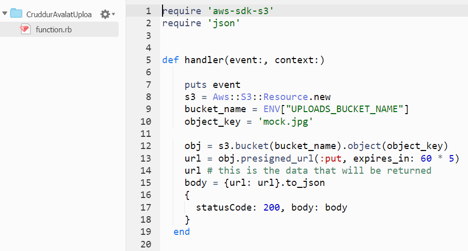
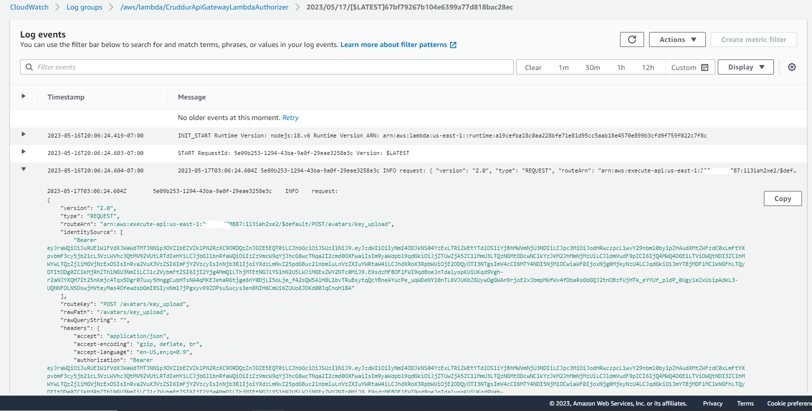
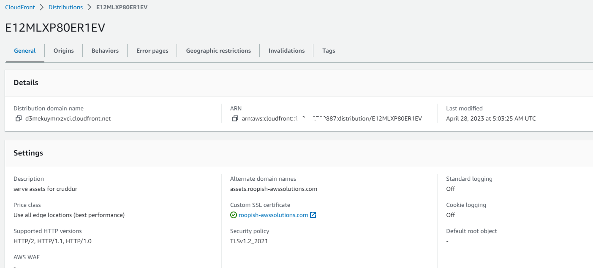

# Week 8 — Serverless Image Processing
1. Deleted the old CDK thumbing-serverless-cdk
2. We will install CDK globally so we can use the AWS CDK CLI anywhere.


3. Created Environment variables and note THUMBING_BUCKET_NAME should always begin with assets. and concatenated by your domain name.
4. Created .env.example since .env is added to gitignore and we have to create it everytime. Made changes to gitpod.yml to include ```

```yaml
- name: cdk
    before: |
      npm install aws-cdk -g
      cd thumbing-serverless-cdk   
      cp .env.example .env
      npm i
```

This installs cdk when gitpod opens and changes the working directory and copy from .env.example to .env

1. We'll initialize a new cdk project within the folder we created:

2. Made changes to thumbing-serverless-cdk-stack.ts to include environment variables.
3. Create S3 bucket:
4. Add the following code to your thumbing-serverless-cdk-stack.ts

```ts
import * as s3 from 'aws-cdk-lib/aws-s3';

const uploadsBucketName: string = process.env.UPLOADS_BUCKET_NAME as string;

createBucket(bucketName: string): s3.IBucket {
    const logicalName: string = 'UploadsBucket';
    const bucket = new s3.Bucket(this, logicalName , {
      bucketName: bucketName,
      removalPolicy: cdk.RemovalPolicy.DESTROY,
    });
    return bucket;
  }
```
## Bootstrapping my Account :
Process of provisioning resources of AWS CDK, before you can deploy CDK apps. Resources like S3 bucket for storing files, IAM roles grants Permissions needed for the deployments.

cdk bootstrap "aws://ACCOUNT_ID/REGION_NAME"

5. Created aws/lambdas/process-images folder and copied example.json, index.js,test.js,s3-image-processing.js
6. cd to aws/lambdas/process-images and Type in npm init -y creates an empty init file called package.json in the folder
7. We will install sharpjs ```npm i sharp```
8. npm i @aws-sdk/client-s3
9. Add node_modules to gitignore
10. cdk deploy 
11. Images are Week8_8_CDKDeploy1  to Week8_8_CDKDeploy4. 


10. To get to Week8_8_CDKDeploy4 go to Lambdas and click on newly created one.
11. We need to run these commands to make sure sharp library works with AWS Lambda correctly ```

```
npm install
rm -rf node_modules/sharp
SHARP_IGNORE_GLOBAL_LIBVIPS=1 npm install --arch=x64 --platform=linux --libc=glibc sharp
```

We put this in /bin/serverless/build and added few more lines of code to make it bash executable. cd to our root directory and then chmod u+x /bin/serverless/build and run the build script

1. Create s3 event notification to lambda: 

Add `this.createS3NotifyToSns(folderOutput,snsTopic,bucket)` to `thumbing-serverless-cdk-stack.ts` and ```

```bash
createS3NotifyToLambda(prefix: string, lambda: lambda.IFunction, bucket: s3.IBucket): void {
    const destination = new s3n.LambdaDestination(lambda);
    bucket.addEventNotification(
      s3.EventType.OBJECT_CREATED_PUT,
      destination,
      {prefix: prefix} // folder to contain the original images
```

1. cdk synth and cdk deploy 

3. Create bash scripts to [/bin/avatar/clear](https://github.com/DataCleansingEnthusiast/aws-bootcamp-cruddur-2023/blob/7f5e53f7c8667eea047acdbe9d3a0684b440b12c/bin/avatar/clear) and [bin/avatar/upload](https://github.com/DataCleansingEnthusiast/aws-bootcamp-cruddur-2023/blob/7f5e53f7c8667eea047acdbe9d3a0684b440b12c/bin/avatar/upload)
4. export DOMAIN_NAME=[roopish-awssolutions.com](http://roopish-awssolutions.com/)
gp env DOMAIN_NAME=[roopish-awssolutions.com](http://roopish-awssolutions.com/)
4. Change to s3.EventType.OBJECT_CREATED_POST from s3.EventType.OBJECT_CREATED_PUT in thumbing-serverless-cdk-stack.ts as you won’t see any cloud watch logs from PUT. 
5. cd thumbing-serverless-cdk-stack and then cdk destroy and then cdk deploy 
6. Create a policy for s3 bucket access so we can modify it. ````const s3ReadWritePolicy = this.createPolicyBucketAccess(bucket.bucketArn)```` and function code I copied from Andrew’s repo.
7. We need to attach lambda policy to the role. lambda.addToRolePolicy(s3UploadsReadWritePolicy); and then cdk deploy. This should change permission of s3 bucket 
 Clear and upload the jpg 
9. check logs in s3 bucket - CloudWatch. There should be no errors
10. go to Amazon s3→buckets→[assets.roopish-awssolutions.com](https://s3.console.aws.amazon.com/s3/buckets/assets.roopish-awssolutions.com)→avatars. We should see both original and processed
11. Make changes to index.js and thumbing and add code for . cdk deploy and clear and upload avatar. Go to Amazon SNS→Topics→cruddur-assets. 2 screenshots. Click on pending confirmation and then confirm subscription. 


## Create SNS Topic
```
createSnsTopic(topicName: string): sns.ITopic{
    const logicalName = "ThumbingTopic";
    const snsTopic = new sns.Topic(this, logicalName, {
      topicName: topicName
    });
    return snsTopic;
  }
  ```

## Create an SNS Subscription
```
createSnsSubscription(snsTopic: sns.ITopic, webhookUrl: string): sns.Subscription {
    const snsSubscription = snsTopic.addSubscription(
      new subscriptions.UrlSubscription(webhookUrl)
    )
    return snsSubscription;
  }
  ```
  ## Create S3 Event Notification to SNS
  ```
  createS3NotifyToSns(prefix: string, snsTopic: sns.ITopic, bucket: s3.IBucket): void {
    const destination = new s3n.SnsDestination(snsTopic)
    bucket.addEventNotification(
      s3.EventType.OBJECT_CREATED_PUT, 
      destination,
      {prefix: prefix}
    );
  }
  ```
  
  
  ## Setting up the cloudfront for Serving Avatars
  Amazon CloudFront is designed to work with S3 to serve your S3 content. Using CloudFront to serve s3 content gives you a lot more flexibility and control. To create a CloudFront distribution, a certificate in the us-east-1 zone for *.<your_domain_name> is required.
Create domain via AWS Certificate Manager, and click "Create records in Route 53" after the certificate is issued.

Create a distribution by:

- set the Origin domain to point to assets.<your_domain_name>
- choose Origin access control settings (recommended) and create a control setting
- select Redirect HTTP to HTTPS for the viewer protocol policy
- choose CachingOptimized, CORS-CustomOrigin as the optional Origin request policy, and SimpleCORS as the response headers policy
- set Alternate domain name (CNAME) as assets.<your_domain_name>
- choose the previously created ACM for the Custom SSL certificate.


create a cloudfront distribution 


Create a new record for the cloudfront in the Route 53 hostedzone.


-Test if cloudfront is working in the browser

-Add a bucket policy to the s3 bucket (assets.roopish-awssolutions.com)


-test in the browser


First run the script [./bin/avatar/build](https://github.com/DataCleansingEnthusiast/aws-bootcamp-cruddur-2023/blob/main/bin/avatar/build) to install the sharp. Then perform cdk deploy then upload the image to the uploaded bucket then it has be copied into assets bucket. Otherwise you will get an error 

##  Implement Users Profile Page
Implemented user profile page to show the avatar, banner, user displayname and number of cruds and edit button.
we need to modify files namely, ActivityFeed.js, CrudButton.js,HomeFeedPage.js,NotificationsFeedPage.js,UserFeedPage.js 
Added new files EditProfileButton.css, EditProfileButton.js,ProfileHeading.css,ProfileHeading.js
create (backend-flask/db/sql/users/show.sql) to get the handler from users [show.sql](https://github.com/DataCleansingEnthusiast/aws-bootcamp-cruddur-2023/blob/a2dff3ef530d613677fcbfa156de4f568f918ad0/backend-flask/db/sql/users/show.sql)

## Implement Migrations Backend Endpoint and Profile Form

### DB Migration
Since our previous postgres database didn't have the column for saving bio information, migration is required. We also need to update some backend scripts 
in order to let users edit bio and save the updated bio in the database.

Create an empty `backend-flask/db/migrations/.keep`, and an executable script [(bin/generate/migration]( https://github.com/DataCleansingEnthusiast/aws-bootcamp-cruddur-2023/blob/main/bin/generate/migration).
Run ./bin/generate/migration add_bio_column, [add_bio_column]( https://github.com/DataCleansingEnthusiast/aws-bootcamp-cruddur-2023/blob/main/backend-flask/db/migrations/16822631436336992_add_bio_column.py) a python script such as backend-flask/db/migrations/16822631436336992_add_bio_column.py will be generated. 


Edit the generated python script with SQL commands ALTER TABLE public.users to add column bio to the table and ALTER TABLE public.users to drop column bio 
From the table.

Create executable scripts [bin/db/migrate](https://github.com/DataCleansingEnthusiast/aws-bootcamp-cruddur-2023/blob/main/bin/db/migrate) and [bin/db/rollback](https://github.com/DataCleansingEnthusiast/aws-bootcamp-cruddur-2023/blob/main/bin/db/rollback). If we run `./bin/db/migrate`, a new column called bio will be created in the db table of users.


`Create a table for schema_information'


### Implement Avatar Uploading 
First, we need to create an API endpoint, which invokes a presigned URL like https://<API_ID>.execute-api.<AWS_REGION>.amazonaws.com. This presigned URL can give access to the S3 bucket (roopish-uploaded-avatars), and can deliver the uploaded image to the bucket.

We will call https://<APIID>.execute-api<USRegion>.amazonaws.com/avatars/key_upload to do the upload, where the /avatars/key_upload resource is manipulated by the POST method. 


/{proxy+} HTTP_PROXY OPTIONS route with only integration Lambda:


We will also create a Lambda function named CruddurAvatarUpload to decode the URL and the request. In addition, we need to implement authorization with another Lambda function named CruddurApiGatewayLambdaAuthorizer, which is important to control the data that is allowed to be transmitted from our gitpod workspace using the APIs.

- create a API Gateway endpoint with Http API in AWS console (To create a this we need a lambda function. So we create one lambda function)
  `create Lambda Function Name `cruddurAvalatUpload` Runtime ruby 2.7 and create a role for the lambda`

    


- Create a Gemfile to libraries for ruby

    

- install gem "aws-sdk-s3" and gem "ox"




`Set environment variable bucketname in the gitpod`
```sh
export UPLOADS_BUCKET_NAME="roopish-uploaded-avatars"
gp env UPLOADS_BUCKET_NAME="roopish-uploaded-avatars"
```


```ruby
require 'aws-sdk-s3'
require 'json'

def handler(event:, context:)
  puts event
  s3 = Aws::S3::Resource.new
  bucket_name = ENV["UPLOADS_BUCKET_NAME"]
  object_key = 'mock.jpg'

  obj = s3.bucket(bucket_name).object(object_key)
  url = obj.presigned_url(:put, expires_in: 60 * 5)
  url # this is the data that will be returned
  body = {url: url}.to_json
  { statusCode: 200, body: body }
end
``` 
- Execute the ruby function to generate presignedUrl


- Install the extension for vs code thunder client


- upload a image and test it in the thunder client select PUT instead of get
Week8_30_ThunderClient1.PNG


### At AWS Lambda, create the corresponding two functions:

`CruddurAvalatUpload`

code source as seen in [aws/lambdas/cruddur-upload-avatar/function.rb](https://github.com/DataCleansingEnthusiast/aws-bootcamp-cruddur-2023/blob/main/aws/lambdas/cruddur-upload-avatar/function.rb) with your own gitpod frontend URL as Access-Control-Allow-Origin
rename Handler as function.handler
add environment variable UPLOADS_BUCKET_NAME
create a new policy PresignedUrlAvatarPolicy as seen in [aws/policies/s3-upload-avatar-presigned-url-policy.json](https://github.com/DataCleansingEnthusiast/aws-bootcamp-cruddur-2023/blob/main/aws/policies/s3-upload-avatar-presigned-url-policy.json), and then attach this policy to the role of this Lambda

`CruddurApiGatewayLambdaAuthorizer`

upload lambda_authorizer.zip into the code source
add environment variables USER_POOL_ID and CLIENT_ID

Copy and paste the lambda function to into the lambda function(function.rb) and add permissions and environments variables to it.

```json
{
    "Version": "2012-10-17",
    "Statement": [
        {
            "Sid": "VisualEditor0",
            "Effect": "Allow",
            "Action": "s3:PutObject",
            "Resource": "arn:aws:s3:::roopish-uploaded-avatars/*"
        }
    ]
}
```





### Verify the JWTs signed by Amazon Cognito

JavaScript library for verifying JWTs signed by Amazon Cognito, and any OIDC-compatible IDP that signs JWTs

- install the 
```json
npm install aws-jwt-verify
```


This library can be used with Node.js 14 or higher. If used with TypeScript, TypeScript 4 or higher is required.
This library can also be used in Web browsers.

Download the node modules folder,index.js,package-lock.json,package.json from the gitpod and zip all the files. create a new lambda and upload the zip file.

- Create a new lambda function called CrudderApiGatewayLambdaAuthorizer with runtime Node.js.18x


Create API Gateway using HTTP API


set Authorization in the API Gateway


use the API gateway https://1l3iah2xe2.execute-api.us-east-1.amazonaws.com/avatars/key_upload in the browser


Made updates to profileform.js and profileForm.css 

add the CORS to the API Gateway.


## Fix CORS for API Gateway
- Lambda CruddurAvatarUpload: code source as seen in ./aws/lambdas/cruddur-upload-avatar/function.rb with my gitpod frontend url as Access-Control-Allow-Origin; renamed Handler as function.handler; environment variable UPLOADS_BUCKET_NAME has value <my_name>-cruddur-uploaded-avatars; its role attached the policy PresignedUrlAvatarPolicy.
- Lambda CruddurApiGatewayLambdaAuthorizer: code source as seen in zipped ./aws/lambdas/lambda-authorizer; add environment variables USER_POOL_ID and CLIENT_ID.
- API Gateway api.<my_domain>: route POST /avatars/key_upload with authorizer CruddurJWTAuthorizer which invoke Lambda CruddurApiGatewayLambdaAuthorizer, also with integration CruddurAvatarUpload; route OPTIONS /{proxy+} with no authorizer, and with integration CruddurAvatarUpload; No configuration for CORS.

`Create a {proxy+} with method option and attach a lambda to it`


`Create custom domain name`


[index.js](https://github.com/DataCleansingEnthusiast/aws-bootcamp-cruddur-2023/blob/main/aws/lambdas/lambda-authorizer/index.js)


## CORS for AWS Lambda Layers
Edit the bucket policy for 

[cors](https://github.com/DataCleansingEnthusiast/aws-bootcamp-cruddur-2023/blob/main/aws/s3/cors.json)


### Create a lambda layer to function cruddurAvatarUpload


Modify the code in the function.rb to get the access token, extension and cognito_user_uuid [function.rb](https://github.com/DataCleansingEnthusiast/aws-bootcamp-cruddur-2023/blob/main/aws/lambdas/cruddur-upload-avatar/function.rb)

Tested the lambda function is triggered when you load a image into upload avatar in the frontend app by making changes to /ProfileForm.js and adding
```
 <div className="popup_content">
             { <div className="upload" onClick={s3uploadkey}>
              Upload Avatar
    </div> }
```

### Check these Variables

I had CORS error and 
 

and as per recommendation of Andrew in the office hours, I added ENV PYTHONUNBUFFERED=1 in [dockerfile](https://github.com/DataCleansingEnthusiast/aws-bootcamp-cruddur-2023/blob/a2dff3ef530d613677fcbfa156de4f568f918ad0/backend-flask/Dockerfile) 

There are some environment variables and should be checked by printing them out. 


- function.rb in CruddurAvatarUpload: set Access-Control-Allow-Origin as your own frontend URL.
- index.js in CruddurApiGatewayLambdaAuthorizer: make sure that token can be correctly extracted from the authorization header.
- Environment variables in the above two Lambdas were added.
- erb/frontend-react-js.env.erb: REACT_APP_API_GATEWAY_ENDPOINT_URL equals to the Invoke URL shown in the API Gateway.
- frontend-react-js/src/components/ProfileForm.js: gateway_url and backend_url are correctly set.
- Pay attention to variable name inconsistency in some scripts, e.g., cognito_user_uuid vs. cognito_user_id.





## Render Avatar from CloudFront
create a cloudfront invalidation for the Object paths to avatars(like /avatars/*)




Serving the avatars using the cognito user UUID:
modify the following files.

- backend-flask/db/sql/users/show.sql
- frontend-react-js/src/components/ProfileAvatar.css
- frontend-react-js/src/components/ProfileAvatar.js
- frontend-react-js/src/components/ProfileHeading.css
- frontend-react-js/src/components/ProfileHeading.js
- frontend-react-js/src/components/ProfileInfo.js
- frontend-react-js/src/lib/CheckAuth.js
- frontend-react-js/src/pages/UserFeedPage.js

The final UI after uploading profile image


