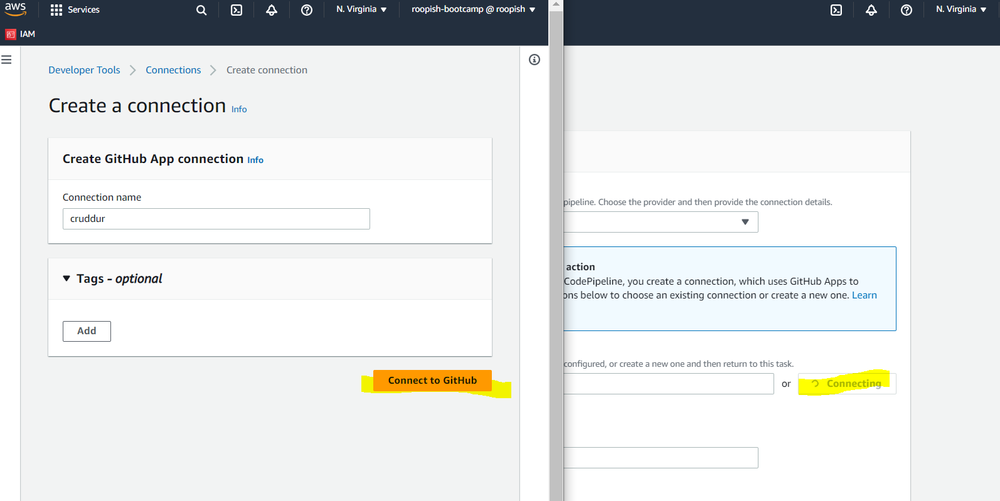
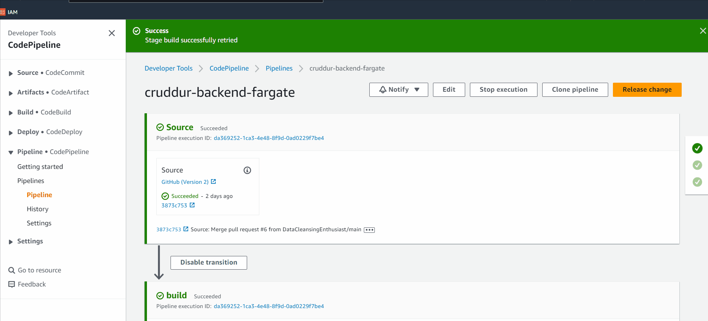

# Week 9 — CI/CD with CodePipeline, CodeBuild and CodeDeploy
This week we learnt about implementing CI/CD. When we spin up a new workspace and do a Docker compose up to start our environment. We run our various scripts to get data to our web app, then launch it. Every time we make code changes we have to run docker compose up or build images manually. So to automate these things we use AWS CodePipeline.

AWS CodePipeline is a fully managed continuous delivery service that helps you automate your release pipeline. It allows users to build, test and deploy code into a test or production environment using either the AWS CLI or Amazon Console. You must configure IAM roles to ensure that those who need access have it and those who don't are restricted.

## **Create Code Pipeline:**

We create a new pipeline `cruddur-backend-fargate`. Andrew told us that there's going to be a lot of backtracking to set up these things. These are the screenshots for creating the pipeline.





## Create new ‘prod’ Branch in GitHub

So when we deploy our code, we will have to do a `git pull` into `prod` branch and merge it. This will trigger the CI/CD pipeline and this is  how we automate the rest of the tasks.

Go to your Repository and click on Pull requests. Click on New Pull request


Select Base Branch as Prod (The new one we created and wants the changes to be pulled in)


Select Compare: branch as Main (The one from which changes needs to be pushed from) and Create Pull request


Then click on create pull request and confirm merge.

## Add extra stage (build)

We added a **(bake)** stage in between **Source** and **Deploy**


## **Configuring CodeBuild:**

buildspec.yml file for CodeBuild [buildspec.yml](https://github.com/DataCleansingEnthusiast/aws-bootcamp-cruddur-2023/blob/main/backend-flask/buildspec.yml)

- Build project configs:


- Source configs:


- Environment configs:


- Buildspecs configs:


- Logs configs:


## Configuring CodePipeline:

I've configured the CodePipeline and integrated the CodeBuild project we have configured above.

- Source configs:


- Build configs:


- Deploy configs:


After deploying I got error in both build and deploy stages. Below is the error message.


I deleted the codebuild project and recreated and added the inline policy in IAM role for the codebuild as shown below


```json
{
    "Version": "2012-10-17",
    "Statement": [
        {
            "Sid": "VisualEditor0",
            "Effect": "Allow",
            "Action": [
                "ecr:BatchCheckLayerAvailability",
                "ecr:CompleteLayerUpload",
                "ecr:GetAuthorizationToken",
                "ecr:InitiateLayerUpload",
                "ecr:PutImage",
                "ecr:UploadLayerPart",
                "ecr:BatchGetImage",
                "ecr:GetDownloadUrlForLayer"
            ],
            "Resource": "*"
        }
    ]
}
```


- Successful codebuild run:


- Pipeline run demo:



- Api health check after the deployment (shows ver 1):


